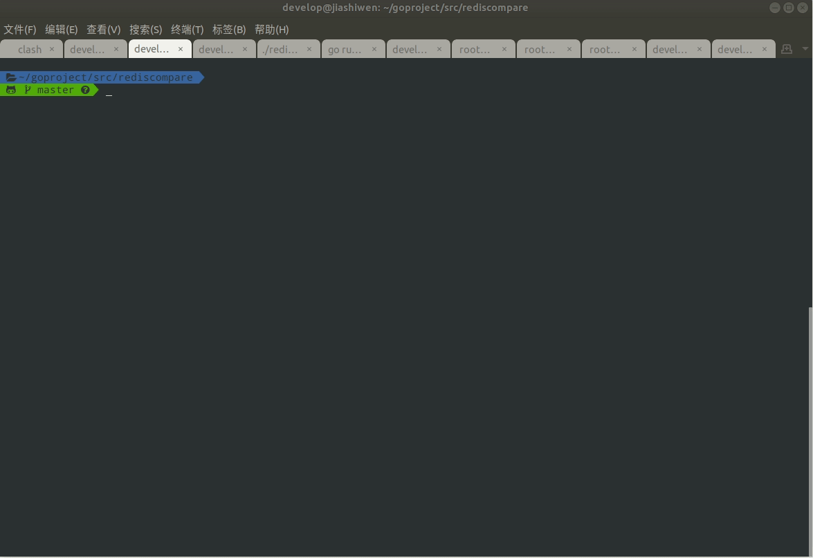

# rediscompare

[简体中文](README_cn.md)

rediscompare is a command line tool used to compare redis database data consistency



## Verification mechanism

rediscompare scans the data in the source database and compares it with the target database through the scan command, and checks it from dimensions such as value length, value, and ttl. Finally, a result file is generated, which contains the key of the data inconsistency and the reason for the inconsistency.

In actual scenarios, some keys may be inconsistent in the first comparison due to transmission delay issues. Rediscompare supports multiple comparisons in a cycle, which is based on the inconsistent keys in the last comparison and generates a result file. The number of cycles can be passed "--comparetimes" "Parameter specification

## Scenario

rediscompare provides a comparison plan for the following scenarios according to the different types of targets and sources

* single2single
    Comparison of redis single instance to single instance. Used to compare the data consistency of a single instance single database

* single2cluster
    Used to compare the data consistency between a db in a single instance and the redis native cluster

* cluster2cluster
    Used to compare the data consistency between redis native cluster and native cluster

* multisingle2single
    Used to compare the data consistency between a collection of multiple databases in multiple single instances and a database in a single instance

* multisingle2cluster
      Used to compare the data consistency between multiple databases collections in multiple single instances and a single instance database

## quick start

### build execute file

```shell
git clone https://github.com/TraceNature/rediscompare.git
cd rediscompare
go mod tidy
go mod vendor
go build -o rediscompare
```

### Usage example

rediscompare supports command line mode and interactive mode, interactive mode supports command prompt. The comparison command supports direct command input and yaml customization. Let's introduce the basic usage of each scene according to the scene.

Use the -i parameter to enter the interactive mode "rediscompare -i"

#### compare subcommand

* single2single  
  * 命令模式   Command mode

    ``` shell
     rediscompare compare single2single  --saddr "10.0.0.1:6379"    --spassword  "redistest0102"  --taddr "10.0.0.2:6379"   --tpassword  "redistest0102" --comparetimes 3
    ``` 

* single2cluster
  * Command mode

     ```shell
     rediscompare compare single2cluster  --saddr  "10.0.0.1:6379"    --spassword  "redistest0102"  --taddr "10.0.1.1:16379,10.0.1.1:16380,10.0.1.2:16379,10.0.1.2:16380,10.0.1.3:16379,10.0.1.3:16380"   --tpassword  "testredis0102" --comparetimes 3
     ```

* cluster2cluster
  * Command mode

     ```shell
     rediscompare  compare cluster2cluster  --saddr  "10.0.0.1:36379,10.0.0.2:36379,10.0.0.3:36379"    --spassword  "testredis0102"  --taddr "10.0.1.1:16379,10.0.1.1:16380,10.0.1.2:16379,10.0.1.2:16380,10.0.1.3:16379,10.0.1.3:16380"   --tpassword  "testredis0102" --comparetimes 3
     ``` 

* multisingle2single
  * Execute yaml file

     ```yaml
     # multisingle2single yaml file
    saddr:
      - addr: "10.0.0.1:6379"
        password: "redistest0102"
        dbs:
          - 0
          - 2
          - 3
      - addr: "10.0.0.2:6379"
        password: "redistest0102"
        dbs:
          - 1
          - 5
          - 9
    taddr: "10.0.0.3:6379"
    tpassword: "redistest0102"
    batchsize: 30
    threads: 2
    ttldiff: 10000
    comparetimes: 3
    report:  true
    scenario: "multisingle2single"
     ```

     ```shell
    rediscompare compare exec  path/miltisingle2single.yml
     ```

* multisingle2cluster  
  * Execute yaml file
       
     ```yaml
     # multisingle2cluster yaml file
     saddr:
       - addr: "10.0.0.1:6379"
         password: "redistest0102"
         dbs:
           - 0
           - 2
           - 3
       - addr: "10.0.0.2:6379"
         password: "redistest0102"
         dbs:
           - 1
           - 5
           - 9
     taddr: "10.0.1.1:16379,10.0.1.1:16380,10.0.1.2:16379,10.0.1.2:16380,10.0.1.3:16379,10.0.1.3:16380"
     tpassword: "testredis0102"
     batchsize: 30
     threads: 2
     ttldiff: 10000
     comparetimes: 3
     report:  true
     scenario: "multisingle2cluster"
     ```

     ```shell
    rediscompare compare exec  path/miltisingle2cluster.yml
     ```

The two scenarios of multisingle2single and multisingle2cluster are difficult to express due to the complex mapping relationship of the databases. Currently, only yaml file execution is supported; single2single, single2cluster, cluster2cluster support command line and yaml file mode.

#### yaml example

For yaml example files, please refer to the .yml file in the execyamlexample directory

#### result  subcommand

The result subcommand is used to format a .result or .rep file. The file is the comparison result, json plaintext. The result command converts the file into a two-dimensional table to increase readability

```shell
rediscompare result parse compare_xxxxxxxx.rep
```
